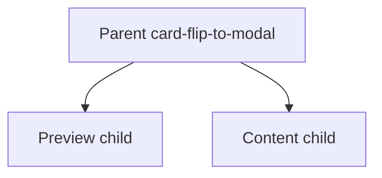

# Card Flip to Modal

A custom WordPress Gutenberg block plugin that displays editable preview content on the page and opens separate editable content inside an accessible modal.

This plugin was created as a WordPress development portfolio project to demonstrate custom block development, React-based Gutenberg editor components, InnerBlocks, TypeScript, front-end JavaScript behavior, Sass styling, accessibility-focused modal behavior, and modern WordPress build tooling.

**Author:** Loren Nicole Simons  
**Requires:** WordPress 6.1+, PHP 7.4  
**License:** GPL-2.0-or-later

## Skills Demonstrated

- Custom parent Gutenberg block with a locked child-block structure
- Child-owned `block.json` attributes for settings that belong to one child
- Parent-owned attributes only for shared animation behavior
- InnerBlocks with allowed-block lists and templates
- InspectorControls and WordPress component controls
- TypeScript and TSX editor components
- Front-end modal behavior compiled from TypeScript
- Sass styling with BEM-style class names and CSS custom properties
- Keyboard, focus, and ARIA-aware modal behavior
- PHP block registration with `@wordpress/scripts` and a committed `build/` folder

## Architecture

The plugin registers three blocks. Settings live on the block they belong to: child-owned when a control only affects the preview card or the modal, and parent-owned when the setting controls the overall flip animation.



- **Parent** `fun-gutenberg-blocks/card-flip-to-modal`: locked wrapper, flip animation on/off, and animation duration
- **Preview child** `fun-gutenberg-blocks/card-flip-to-modal-preview`: the visible card and its appearance settings
- **Content child** `fun-gutenberg-blocks/card-flip-to-modal-content`: modal markup plus appearance, behavior, accessibility, and close-button settings

Select the parent or the relevant child in the editor to see that block’s sidebar panels.

## Features

- Custom parent Gutenberg block with a locked Preview + Modal Content structure
- Separate editable preview content and modal content
- Click-to-open modal behavior
- Keyboard activation with Enter and Space
- Escape key closes the modal
- Close button with customizable text, label, position, size, and colors
- Optional backdrop-click close behavior
- Optional page scroll locking while the modal is open
- Optional flip animation from the preview card into the modal
- Focus moves into the modal when opened
- Focus remains trapped inside the modal while open
- Focus returns to the preview card after closing
- Editable modal ARIA label for screen readers
- Modal content scrolls internally when content is long
- Multiple Card Flip to Modal blocks can be used on one page
- Opening one modal closes any other open modal
- Modal width presets: Small, Medium, and Large
- Custom modal width using valid CSS size values
- Preview card and modal padding, margin, border, radius, and color controls
- Compact color picker UI in the block sidebar
- Per-block styling using saved CSS variables
- Per-block modal behavior using saved data attributes
- Front-end behavior powered by lightweight TypeScript-compiled JavaScript
- Sass styling with BEM-style class names

## Installation

1. Download or clone this repository.
2. Copy the plugin folder into your WordPress `wp-content/plugins/` directory.
3. In the WordPress admin, go to **Plugins**.
4. Activate **Card Flip to Modal**.
5. Open the block editor for a page or post.
6. Insert the **Card Flip to Modal** block.
7. Edit the Preview Area and Modal Content area.
8. Select the parent, preview, or modal content block to configure its sidebar settings.

The `build/` folder is included in this repository so the plugin can be installed and activated without running npm commands.

## How to Use

After inserting the block, you will see two editable areas in the editor. Editor-only labels sit outside the visual preview so they do not distort the card or modal preview.

### Preview Area

The Preview Area is the content visitors see on the page before opening the modal.

This area can include supported blocks such as:

- Heading
- Paragraph
- Image
- List
- Buttons
- Video
- Group
- Columns
- Shortcode
- Latest Posts

Visitors can click this area, or focus it with the keyboard and press Enter or Space, to open the modal.

To open from a specific element instead of the whole card, select the preview block and enter that element’s HTML ID under **Card Settings**. Set the same ID on the inner block under **Advanced → HTML anchor**. Leave the setting blank to keep whole-card open.

### Modal Content

The Modal Content area is the expanded content shown inside the modal.

This area can include longer text, images, lists, buttons, video, grouped layouts, columns, shortcodes, latest posts, or other supported content blocks.

### Animation Settings

Select the **parent** Card Flip to Modal block. The sidebar includes **Animation Settings**.

- Enable flip animation
- Animation duration in milliseconds

When the flip animation is enabled, the preview card flips and grows into the modal.

### Card Settings

Select the **preview** child block. The sidebar includes **Card Settings**.

- Element ID that opens the modal (optional; leave blank to open from the whole card, or enter an HTML ID also set on an inner block under Advanced → HTML anchor)
- Minimum height
- Padding
- Margin
- Card shadow on/off
- Hover lift effect on/off
- Background color
- Border color
- Border style
- Border thickness
- Border radius
- Text color

The color controls use a compact color picker UI with a color indicator, choose button, and reset button.

### Modal Settings

Select the **modal content** child block. The sidebar includes **Modal Settings**.

The modal width can be set to:

- Small
- Medium
- Large
- Custom

Custom width accepts valid CSS size values such as:

- `720px`
- `80vw`
- `45rem`
- `60%`
- `clamp(320px, 80vw, 1000px)`
- `calc(100vw - 4rem)`

If the custom width is invalid, the editor shows a warning and the default width is used until the value is valid.

Additional modal appearance settings include:

- Background color
- Padding
- Margin
- Border style
- Border color
- Border thickness
- Border radius

### Modal Behavior Settings

With the modal content block selected, the sidebar includes **Modal Behavior Settings**.

- Close when clicking backdrop
- Lock page scroll while modal is open

These settings are saved per block instance, so different Card Flip to Modal blocks on the same page can use different behavior.

### Accessibility Settings

With the modal content block selected, the sidebar includes **Accessibility Settings**.

- Modal label: used by screen readers when the modal has no heading. If a heading is present, that heading names the dialog.

### Close Button Settings

With the modal content block selected, the sidebar includes **Close Button Settings**.

- Close button text
- Close button accessible label
- Close button position: top-right or top-left
- Close button size
- Close button border radius
- Background color
- Text color
- Border color

If the visible text or accessible label is left blank, the default symbol or label is used.

## Accessibility Notes

The block includes modal and keyboard accessibility behavior:

- Preview card is keyboard-focusable when no open-element ID is set.
- When an open-element ID is set, only that inner element opens the modal.
- Enter opens the modal.
- Space opens the modal.
- Escape closes the modal.
- Focus moves into the modal when it opens.
- Focus remains trapped inside the modal while it is open.
- Focus returns to the trigger after the modal closes.
- The close button is always visible and keyboard-focusable.
- The modal label and close-button accessible label can be customized in the sidebar.
- Background page scrolling can be locked while the modal is open.
- The modal uses a heading as its accessible name when one is present, with a customizable fallback label.
- Modal behavior supports multiple block instances on the same page.

## Project Structure

The plugin follows the standard WordPress `create-block` layout: source files live in `src/`, and WordPress loads the compiled files from `build/`.

```text
card-flip-to-modal/
├── card-flip-to-modal.php
├── package.json
├── README.md
├── src/
│   ├── card-flip-to-modal/           # Parent block
│   │   ├── block.json
│   │   ├── edit.tsx
│   │   ├── save.tsx
│   │   ├── view.ts
│   │   ├── style.scss
│   │   └── editor.scss
│   ├── card-flip-to-modal-preview/   # Preview child
│   └── card-flip-to-modal-content/   # Modal content child
└── build/                            # Compiled assets loaded by WordPress
```

Each block is defined in `block.json` and registered from the main plugin file. The parent block provides `editorScript`, `editorStyle`, `style`, and `viewScript`. Child blocks store their own attributes and editor scripts.

## Development

These steps are only needed if you want to edit the plugin source code.

The source files are written in TypeScript and TSX. WordPress loads the compiled JavaScript and CSS from the `build/` folder. The `build/` folder is committed so the plugin works without npm.

Install dependencies:

```bash
npm install
```

Watch source files and rebuild during development:

```bash
npm start
```

Create a production build:

```bash
npm run build
```

Run unit tests:

```bash
npm run test:unit
```

Watch unit tests during development:

```bash
npm run test:unit:watch
```

## Screenshots

Editor and front-end screenshots can be added under `docs/screenshots/`.

## License

This plugin is licensed under [GPL-2.0-or-later](https://www.gnu.org/licenses/gpl-2.0.html).
